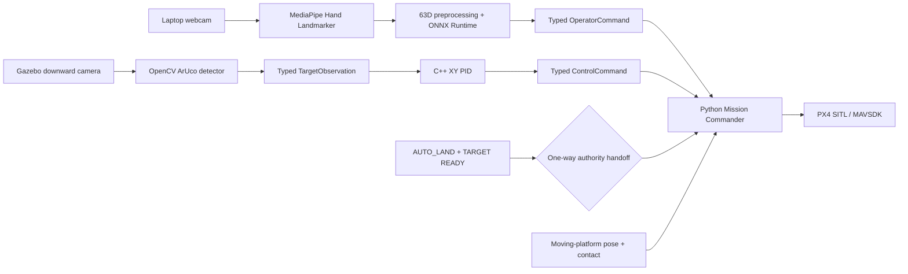

# Human-Guided Autonomous UAV Precision Landing

Human-guided autonomous UAV precision landing in PX4/Gazebo using real-time
hand-gesture perception and ArUco visual servoing.

The project is a simulation-only reference system: a laptop webcam gives the
operator manual body-frame flight control, while a downward Gazebo camera
continuously searches for a moving ArUco landing platform. A valid
`AUTO_LAND` pose at `TARGET READY` performs a one-way authority handoff to
the autonomous C++ landing controller.

## Final demo

```text
Webcam gesture → takeoff and manual guidance
Downward camera → moving ArUco target search → TARGET READY
AUTO_LAND authorization
HUMAN → AUTONOMOUS authority handoff
C++ XY PID → tracking → descent → contact-confirmed touchdown
Platform stop → PX4 disarm → Mission Complete
```

Run it in the portable CPU mode with `make demo-final` (the same as
`make demo-final-cpu`). Machines with a configured NVIDIA Container Toolkit
may use `make demo-final-gpu`.

## Features

### Simulation and runtime

- PX4 SITL pinned to commit
  `78a44ed439ee941acd4844ff8ceaedbfe0faea56`;
- Gazebo Harmonic world, downward camera and physical contact sensor;
- ROS 2 Humble and MAVSDK in a reproducible Docker image;
- CPU/software-rendered default with optional NVIDIA rendering override;
- bounded foreground runners that clean up only their own containers.

### Robotics

- typed ROS 2 `OperatorCommand`, `TargetObservation`, `ControlCommand`,
  `MovingPlatformState` and `MissionStatus` interfaces;
- Python Mission Commander as the sole MAVSDK/PX4 owner;
- native C++ XY PID with deadband, saturation, anti-windup and stale-input
  protection;
- fixed and physically moving ArUco precision landing;
- continuous moving-platform pose/motion evidence from Gazebo;
- contact-confirmed touchdown, platform stop and telemetry-confirmed disarm;
- explicit, irreversible HUMAN → AUTONOMOUS control-authority handoff.

### Computer vision and dashboard

- OpenCV ArUco ID 0 detection from the Gazebo downward camera;
- typed, timestamped observations with freshness and validity checks;
- camera/dashboard pipeline showing mission telemetry and target state;
- `GESTURE MANUAL` / `AUTO LAND`, `HUMAN` / `AUTONOMOUS`, gesture,
  confidence, veto and runtime performance status.

### Gesture ML

- laptop-webcam acquisition and MediaPipe 21-point hand landmarks;
- wrist centering, palm scaling, handedness canonicalization and palm rotation;
- custom PyTorch-trained 63 → 128 → 64 → 7 MLP;
- seven gesture classes and session-isolated grouped cross-hand 2-fold CV;
- deterministic `AUTO_LAND` thumb-semantic veto;
- tracked ONNX classifier and metadata, ONNX Runtime CPU deployment;
- fresh `NO_COMMAND` on no-hand input and TTL/debounce flight gates.

## Gesture commands

| Command | Static pose | Manual-mode behavior |
|---|---|---|
| `TAKEOFF` | Four fingers extended, thumb folded | Stable takeoff request to 3.0 m |
| `FORWARD` | Index extended | +0.5 m/s body-forward |
| `BACKWARD` | Index and middle extended | −0.5 m/s body-forward |
| `LEFT` | Thumb extended, other fingers folded | −0.5 m/s body-right |
| `RIGHT` | Pinky extended, other fingers folded | +0.5 m/s body-right |
| `HOLD` | Open palm | Zero body-frame XY |
| `AUTO_LAND` | Thumb and pinky extended | Request handoff when target is ready |

`TAKEOFF` requires 12 stable frames. Other commands require four stable
frames, confidence ≥0.80 and a fresh request no older than 0.50 seconds. No
hand produces `NO_COMMAND`; Mission Commander converts no-hand, stale,
low-confidence and invalid-state input to safe HOLD rather than replaying the
last command.

## Architecture



The gesture node publishes operator intent only; it never owns MAVSDK. Mission
Commander owns the vehicle and mission state. Before handoff it applies
accepted HUMAN velocity requests. After `AUTO_LAND` passes the current-target
gate, HUMAN authority is permanently revoked and only the C++ landing PID
supplies XY correction.

Gazebo pose/contact data proves platform motion and touchdown but is never used
as flight-control target input. Visual control uses only the UAV camera and
ArUco observations.

## Safety and control authority

- Mission Commander is the only MAVSDK/PX4 command owner.
- The C++ node owns autonomous landing XY control, not mission sequencing.
- `AUTO_LAND` requires three distinct valid target observations, each at most
  0.50 s old.
- An early `AUTO_LAND` request is rejected and must be released before retry.
- Handoff first commands zero XY, then latches AUTONOMOUS authority.
- Manual gestures cannot regain authority after handoff.
- No hand, stale perception, low confidence and thumb-veto rejection cannot
  reuse an actionable command.
- Touchdown is contact-confirmed in moving/final mode; the platform is stopped
  before mission completion and disarm is verified from telemetry.

## ML model and evaluation

Dataset v1 contains 2,786 authoritative landmark samples across seven classes.
Each class has one right-hand and one left-hand session. Evaluation used
session-isolated grouped cross-hand 2-fold cross-validation, never a random
frame split.

| Fold | Direction | Accuracy | Macro F1 |
|---|---|---:|---:|
| A | right → left | 0.8595 | 0.8541 |
| B | left → right | 0.8920 | 0.8864 |
| Mean | grouped 2-fold CV | 0.8757 | 0.8703 |

These are grouped CV results, not an independent held-out test metric.
Dataset v1 has no independent final test set.

The thumb veto reduced `AUTO_LAND` false positives from 95 to 5 and FPR from
3.98% to 0.21%, while recall changed from 97.25% to 96.00%. Safety-filtered
command macro F1 changed from 0.8709 to 0.8842.

The 16,903-parameter final MLP was trained on all 2,786 samples only after the
recipe was frozen. PyTorch → ONNX validation achieved 100% argmax agreement
with maximum absolute logit error ≈9.54e-06. Final all-data training metrics
are optimization evidence, not generalization evidence.

See [the gesture model card](gesture/MODEL_CARD.md) for preprocessing,
leakage prevention, safety calibration and deployment details.

## Requirements

### Common

- Linux with X11 display support (the reference host used Ubuntu 26.04);
- Docker Engine and the Docker Compose plugin;
- an available webcam such as `/dev/video0`;
- `curl`, `sha256sum`, `make` and
  [uv](https://docs.astral.sh/uv/) for the Python 3.10 environment;
- enough resources for PX4/Gazebo and the Docker build (16 GB RAM and 30 GB
  free disk are practical recommendations).

The release gate used Docker 29.7.2, Compose 5.4.0, uv 0.11.28 and CPython
3.10.20. The container fixes ROS 2 Humble, Gazebo Harmonic and the PX4 commit,
so the host does not need ROS, Gazebo or PX4 installed.

### CPU-only

No NVIDIA GPU or NVIDIA Container Toolkit is required. Base
`docker-compose.yml` sets Mesa/software rendering. Gazebo can run slower than
the accelerated path, especially on low-core-count machines.

### Optional NVIDIA acceleration

Install a compatible NVIDIA driver and NVIDIA Container Toolkit, then use the
`-gpu` Make target. `docker-compose.gpu.yml` is an override; it is never
loaded by CPU commands.

## From zero: quick start

1. Clone and enter the repository.

   ```bash
   git clone https://github.com/duhoangphi2602/UAV-precision-landing-simulation.git
   cd UAV-precision-landing-simulation
   ```

2. Install Docker Engine, the Compose plugin, `make`, `curl` and `uv`.
   Start Docker and ensure your user can access it:

   ```bash
   docker info
   docker compose version
   uv --version
   ```

3. Build the simulation image and ROS workspace. The build uses the pinned PX4
   revision from `docker/versions.env`.

   ```bash
   make build
   ```

4. Create the dedicated Python 3.10 environment and download the versioned
   MediaPipe model. The helper verifies SHA-256 before installation.

   ```bash
   make setup-gesture
   ```

5. Verify the tracked ONNX classifier, metadata and downloaded Hand Landmarker.

   ```bash
   make verify-assets
   ```

6. Run the complete source/unit/ROS test gate.

   ```bash
   make test
   ```

7. Run the final foreground demo.

   CPU/software rendering:

   ```bash
   make demo-final-cpu
   ```

   Optional NVIDIA rendering:

   ```bash
   make demo-final-gpu
   ```

`make demo-final` is the portable CPU alias. The final ONNX classifier and
its preprocessing/class mapping/veto metadata are included in the clone.
Only the third-party MediaPipe task is downloaded during setup.

## Running individual demos

Run one foreground demo at a time:

| Capability | Command |
|---|---|
| Historical Python fixed-controller baseline | `make demo-python` |
| Accepted C++ fixed ArUco landing | `make demo-cpp` |
| Accepted moving-platform ArUco landing | `make demo-moving-aruco` |
| Gesture manual flight only | `make demo-gesture-control` |
| Final gesture → autonomous landing | `make demo-final` |

The gesture-only demo recognizes `AUTO_LAND` but intentionally reports
`LANDING_HANDOFF_NOT_ENABLED`; use the final demo for the complete handoff.
Use `make stop` to remove only known project demo containers.

To use a webcam other than `/dev/video0`:

```bash
GESTURE_CAMERA_INDEX=1 make demo-final
```

## What to expect

The demo opens:

- Gazebo with the UAV and moving ArUco platform;
- **Drone Camera View**, with target/mission/authority telemetry;
- **Final Gesture Operator**, with gesture confidence, filter/veto state and
  inference timing.

After `TAKEOFF`, guide the UAV until the dashboard reports `TARGET READY`.
Hold `AUTO_LAND` until accepted. Expected terminal evidence includes:

```text
AUTO_LAND_AUTHORIZED: HUMAN -> AUTONOMOUS
Disarmed. Mission Complete.
FINAL_DEMO=PASS
```

`Q` or `Esc` closes the gesture operator and publishes a safe HOLD before
exit. The foreground runner saves ignored diagnostics under `artifacts/` and
removes its containers.

## Testing

The maintained aggregate gate is:

```bash
make test
```

Its components are:

```bash
# Gesture, ONNX contract and command-filter tests
gesture/.venv/bin/python -m pytest gesture/tests -q

# ROS package build, Python package tests and 10 C++ PID GTests
docker compose run --rm --no-deps simulation bash -c \
  "cd /home/devuser/drone_landing_ws && \
   colcon build --symlink-install --packages-select \
     precision_landing_interfaces precision_landing_control_cpp px4_vision_autonomy && \
   colcon test --packages-select \
     precision_landing_interfaces precision_landing_control_cpp px4_vision_autonomy && \
   colcon test-result --verbose"

# Independent ArUco tests
docker compose run --rm --no-deps simulation \
  python3 -m pytest /home/devuser/tests/test_aruco.py -q
```

## Project structure

```text
.
├── Dockerfile                 # ROS 2/PX4/Gazebo image
├── docker-compose.yml         # portable CPU/software-rendered base
├── docker-compose.gpu.yml     # optional NVIDIA override
├── docker/                    # container entrypoint and pinned PX4 version
├── drone_landing_ws/          # typed interfaces, C++ PID, mission/CV nodes
├── gesture/
│   ├── deploy/                # tracked ONNX + runtime metadata
│   ├── configs/               # frozen training/runtime/control contracts
│   ├── tests/                 # gesture and deployment tests
│   └── *.py                   # collection, training, export and runtime source
├── scripts/                   # setup, verification and foreground runners
├── tests/                     # independent ArUco contract tests
├── Makefile
└── THIRD_PARTY_NOTICES.md
```

Local datasets, virtual environments, generated experiments, colcon outputs
and runtime logs are deliberately ignored.

## Verified performance

| Measurement | Accepted result |
|---|---:|
| Final Gazebo camera pipeline | 18.01 FPS |
| CPU-only software-rendered camera gate | approximately 2.3 FPS |
| Final dashboard refresh | 17.20 Hz |
| Gesture live smoke | 17.13 FPS |
| MediaPipe Hand Landmarker | 20.23 ms |
| ONNX Runtime classifier | 0.089 ms live; 0.006 ms p50 classifier-only |
| Fixed landing touchdown horizontal error | 0.0288 m |
| Moving landing touchdown horizontal error | 0.0538 m |
| Final integrated touchdown horizontal error | 0.0614 m |

These values describe the accepted reference-host runs, not guaranteed
cross-machine performance. Software-rendered Gazebo may be slower than GPU
rendering. The release gate verified CPU-only PX4, Gazebo, ROS camera bridge,
ArUco detection and ONNX inference, but did not repeat the manual full-flight
acceptance in CPU mode; the accepted end-to-end final run used the accelerated
path.

## Troubleshooting

### Docker daemon unavailable

Run `docker info`. Start Docker and fix group/socket access before retrying;
the project does not use `sudo docker` internally.

### X11 window does not open

Confirm `echo $DISPLAY` is non-empty and X11 is active. The runners call
`scripts/allow_x11.sh`; Wayland-only sessions may need XWayland. If
`XAUTHORITY` is nonstandard, export its absolute path before running.

### Webcam is not `/dev/video0`

Inspect `v4l2-ctl --list-devices` or `ls -l /dev/video*`, then set
`GESTURE_CAMERA_INDEX`, for example:

```bash
GESTURE_CAMERA_INDEX=1 make demo-gesture-control
```

Close browsers or conferencing applications that already own the device.

### PX4 build revision

The supported revision is
`78a44ed439ee941acd4844ff8ceaedbfe0faea56`. `make build` reads it from
`docker/versions.env`. Do not substitute another revision when reproducing
the accepted release.

### NVIDIA runtime errors

Use `make demo-final` or `make demo-final-cpu`; neither requests an NVIDIA
device. Only `make demo-final-gpu` requires the NVIDIA driver/toolkit.

### CPU Gazebo is slow

Software rendering is the portable fallback, not a claim of GPU-equivalent
performance. Close other heavy applications, verify sufficient RAM and use the
GPU target only when NVIDIA Container Toolkit is correctly configured.

### Missing or mismatched MediaPipe model

Run `make setup-gesture` again. The downloader refuses an asset whose SHA-256
does not match
`fbc2a30080c3c557093b5ddfc334698132eb341044ccee322ccf8bcf3607cde1`.
`make verify-assets` checks every runtime artifact.

## Scope

This repository demonstrates software-in-the-loop simulation. It makes no
claim of real-hardware flight validation, airworthiness, certification or
fitness for safety-critical deployment. Real flight would require hardware
integration, calibrated cameras, redundant safety controls, regulatory review
and substantially broader validation.

## License

Project-authored code and documentation are released under the
[MIT License](LICENSE). Third-party components and downloaded model assets
remain under their upstream terms; see
[THIRD_PARTY_NOTICES.md](THIRD_PARTY_NOTICES.md).
